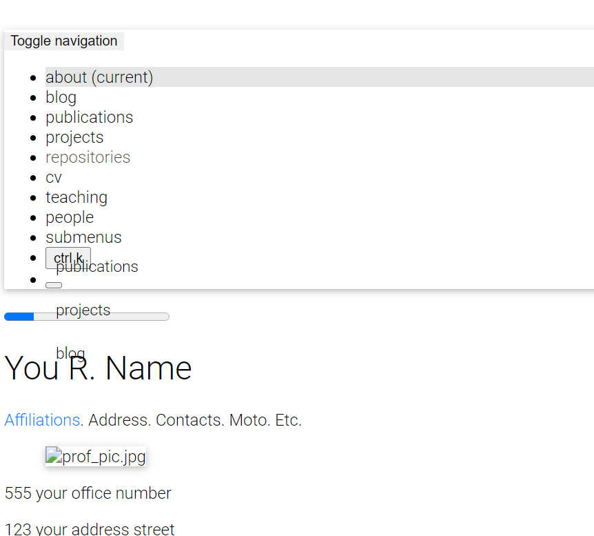

# Perguntas Frequentes

Aqui estão algumas perguntas frequentes. Se você tiver uma pergunta diferente, verifique se ela já não foi respondida na seção de Perguntas & Respostas das [Discussões do GitHub](https://github.com/alshedivat/al-folio/discussions/categories/q-a) do al-folio original. Caso contrário, sinta-se à vontade para fazer uma nova pergunta lá.

Se sua questão estiver relacionada à localização, verifique se ela já não foi respondida na seção de Perguntas & Respostas das [Discussões do GitHub](https://github.com/george-gca/multi-language-al-folio/discussions/categories/q-a). Se não, fique à vontade para perguntar algo novo por lá.

- [Perguntas Frequentes](#perguntas-frequentes)
  - [Após criar um novo repositório a partir deste template e configurar o repositório, recebo um erro de implantação. O site não deveria ser implantado automaticamente de forma correta?](#após-criar-um-novo-repositório-a-partir-deste-template-e-configurar-o-repositório-recebo-um-erro-de-implantação-o-site-não-deveria-ser-implantado-automaticamente-de-forma-correta)
  - [Estou usando um domínio personalizado (por exemplo, `foo.com`). Meu domínio personalizado fica em branco nas configurações do repositório após cada implantação. Como posso resolver isso?](#estou-usando-um-domínio-personalizado-por-exemplo-foocom-meu-domínio-personalizado-fica-em-branco-nas-configurações-do-repositório-após-cada-implantação-como-posso-resolver-isso)
  - [Minha página funciona localmente, mas após a implantação ela não é construída e lança o erro `Unknown tag 'toc'`. Como posso resolver isso?](#minha-página-funciona-localmente-mas-após-a-implantação-ela-não-é-construída-e-lança-o-erro-unknown-tag-toc-como-posso-resolver-isso)
  - [Minha página funciona localmente, mas após a implantação ela não é exibida corretamente (CSS e JS não são carregados adequadamente). Como posso resolver isso?](#minha-página-funciona-localmente-mas-após-a-implantação-ela-não-é-exibida-corretamente-css-e-js-não-são-carregados-adequadamente-como-posso-resolver-isso)
  - [O feed Atom não funciona. Por quê?](#o-feed-atom-não-funciona-por-quê)
  - [Meu site não funciona quando habilito `related_blog_posts`. Por quê?](#meu-site-não-funciona-quando-habilito-related_blog_posts-por-quê)
  - [Ao tentar implantar, ele solicita credenciais de login do GitHub, mas o GitHub desativou a autenticação por senha e o processo é encerrado com erro. Como posso corrigir isso?](#ao-tentar-implantar-ele-solicita-credenciais-de-login-do-github-mas-o-github-desativou-a-autenticação-por-senha-e-o-processo-é-encerrado-com-erro-como-posso-corrigir-isso)
  - [Quando executo manualmente o workflow do Lighthouse Badger, ele falha com `Error: Input required and not supplied: token`. Como posso corrigir isso?](#quando-executo-manualmente-o-workflow-do-lighthouse-badger-ele-falha-com-error-input-required-and-not-supplied-token-como-posso-corrigir-isso)
  - [Meu código funciona bem localmente, mas quando crio um commit e o envio, ele falha com `prettier code formatter workflow run failed for main branch`. Como posso resolver isso?](#meu-código-funciona-bem-localmente-mas-quando-crio-um-commit-e-o-envio-ele-falha-com-prettier-code-formatter-workflow-run-failed-for-main-branch-como-posso-resolver-isso)
  - [Após atualizar meu site com novo conteúdo, mesmo com uma pequena mudança, a ação do GitHub lança um erro ou exibe um aviso. O que aconteceu?](#após-atualizar-meu-site-com-novo-conteúdo-mesmo-com-uma-pequena-mudança-a-ação-do-github-lança-um-erro-ou-exibe-um-aviso-o-que-aconteceu)
  - [Estou tentando implantar meu site, mas falha com `Could not find gem 'jekyll-diagrams' in locally installed gems`. Como resolvo isso?](#estou-tentando-implantar-meu-site-mas-falha-com-could-not-find-gem-jekyll-diagrams-in-locally-installed-gems-como-resolvo-isso)
  - [Como posso atualizar a versão do Academicons no template](#como-posso-atualizar-a-versão-do-academicons-no-template)
  - [Como posso atualizar a versão do Font Awesome no template](#como-posso-atualizar-a-versão-do-font-awesome-no-template)
  - [Como posso atualizar a versão do Tabler Icons no template](#como-posso-atualizar-a-versão-do-tabler-icons-no-template)
  - [O que significam todas essas ações/workflows do GitHub?](#o-que-significam-todas-essas-açõesworkflows-do-github)
  - [Como posso usar o ID do Google Search Console no template?](#como-posso-usar-o-id-do-google-search-console-no-template)

---

### Após criar um novo repositório a partir deste template e configurar o repositório, recebo um erro de implantação. O site não deveria ser implantado automaticamente de forma correta?

Sim, se você estiver usando a versão `v0.3.5` ou superior, o site será automaticamente e corretamente reimplantado logo após o seu primeiro commit. Faça algumas alterações (por exemplo, altere as informações do seu site em `_config.yml`), faça um commit e envie (push). Certifique-se de seguir as [instruções de implantação](https://github.com/alshedivat/al-folio#deployment). (Issue relevante: [209](https://github.com/alshedivat/al-folio/issues/209#issuecomment-798849211).)

---

### Estou usando um domínio personalizado (por exemplo, `foo.com`). Meu domínio personalizado fica em branco nas configurações do repositório após cada implantação. Como posso resolver isso?

Você precisa adicionar um arquivo chamado `CNAME` na branch `main` ou `source` do seu repositório. Esse arquivo deve conter o seu domínio personalizado. (Issue relevante: [130](https://github.com/alshedivat/al-folio/issues/130).)

---

### Minha página funciona localmente, mas após a implantação ela não é construída e lança o erro `Unknown tag 'toc'`. Como posso resolver isso?

Certifique-se de ter seguido corretamente as [instruções de implantação](#deployment) na seção anterior. Você deve ter configurado a branch de implantação como `gh-pages`. (Issue relacionada: [1438](https://github.com/alshedivat/al-folio/issues/1438).)

---

### Minha página funciona localmente, mas após a implantação ela não é exibida corretamente (CSS e JS não são carregados adequadamente). Como posso resolver isso?

Se o site não carrega o tema, o layout fica desorganizado e todos os links estão quebrados, apresentando a página principal desta forma:



verifique se os caminhos `url` e `baseurl` estão especificados corretamente no `_config.yml`. Defina `url` como `https://<seu-usuario-github>.github.io` ou como `https://<seu.dominio.personalizado>` se estiver utilizando um domínio personalizado. Se você estiver implantando um site <ins>pessoal</ins> ou de <ins>organização</ins>, deixe `baseurl` **vazio** (não o remova). Se estiver implantando uma página de projeto, defina `baseurl: /<nome-do-seu-repositorio>/`. Se todas as etapas anteriores foram feitas corretamente, o que falta é que o navegador atualize novamente a folha de estilo. Para isso, você pode:

- pressionar [Shift + F5 em navegadores baseados no Chromium](https://support.google.com/chrome/answer/157179#zippy=%2Cwebpage-shortcuts) ou [Ctrl + F5 em navegadores baseados no Firefox](https://support.mozilla.org/en-US/kb/keyboard-shortcuts-perform-firefox-tasks-quickly) para recarregar a página ignorando o cache;
- limpar o histórico do navegador;
- ou simplesmente tentar em uma sessão privativa, como explicado em [Chrome](https://support.google.com/chrome/answer/95464) e [Firefox](https://support.mozilla.org/en-US/kb/private-browsing-use-firefox-without-history).

---

### O feed Atom não funciona. Por quê?

Certifique-se de especificar corretamente os campos `url` e `baseurl` no `_config.yml`. O plugin de feed RSS funciona com os campos `title`, `url`, `description` e `author` configurados de forma adequada. Preencha-os corretamente e tente novamente.

---

### Meu site não funciona quando habilito `related_blog_posts`. Por quê?

Isso provavelmente se deve ao plugin [classifier reborn](https://github.com/jekyll/classifier-reborn), que é utilizado para calcular posts relacionados. Se o erro indicar `Liquid Exception: Zero vectors can not be normalized...` ou `sqrt': Numerical argument is out of domain - "sqrt"`, significa que não foi possível calcular posts relacionados para um post em específico. Geralmente isso acontece por causa de posts vazios ou mínimos (por exemplo, contendo apenas palavras irrelevantes ou somente [stop words](https://en.wikipedia.org/wiki/Stop_words)) ou até devido a [caracteres específicos](https://github.com/jekyll/classifier-reborn/issues/194) usados em seus posts. Além disso, o cálculo dos posts similares é feito para toda página usando `layout: post`, incluindo anúncios. Para alterar esse comportamento, basta adicionar `related_posts: false` no front matter da página que você não deseja exibir posts relacionados. Outra solução é desativar completamente o LSI (latent semantic indexing) definindo a flag `lsi` como `false` no `_config.yml`. (Issue relacionada: [#1828](https://github.com/alshedivat/al-folio/issues/1828).)

---

### Ao tentar implantar, ele solicita credenciais de login do GitHub, mas o GitHub desativou a autenticação por senha e o processo é encerrado com erro. Como posso corrigir isso?

Abra o arquivo `.git/config` com o seu editor preferido. Altere a parte que diz `https` na URL para `ssh`. Em seguida, tente implantar novamente.

---

### Quando executo manualmente o workflow do Lighthouse Badger, ele falha com `Error: Input required and not supplied: token`. Como posso corrigir isso?

Você precisa [criar um token de acesso pessoal (PAT)](https://docs.github.com/en/authentication/keeping-your-account-and-data-secure/managing-your-personal-access-tokens#creating-a-fine-grained-personal-access-token) e adicioná-lo como um secret chamado `LIGHTHOUSE_BADGER_TOKEN` no seu repositório. Para mais informações, consulte a [documentação do Lighthouse Badger](https://github.com/MyActionWay/lighthouse-badger-workflows#lighthouse-badger-easyyml).

---

### Meu código funciona bem localmente, mas quando crio um commit e o envio, ele falha com `prettier code formatter workflow run failed for main branch`. Como posso resolver isso?

Implementamos suporte para [formatação de código com Prettier](https://prettier.io/) em [#2048](https://github.com/alshedivat/al-folio/pull/2048). Isso basicamente garante que seu código esteja [bem formatado](https://prettier.io/docs/en/). Para garantir que seu código esteja em conformidade com o Prettier, você tem algumas opções:

- Se você estiver rodando localmente com `Docker` e utilizando [containers de desenvolvimento](https://github.com/alshedivat/al-folio/blob/main/INSTALL.md#configuracao-local-com-containers-de-desenvolvimento), o Prettier já está incluído.
- Se você não utiliza Docker, é simples integrá-lo ao seu IDE preferido por meio de uma [extensão](https://prettier.io/docs/en/editors).
- Se desejar executá-lo manualmente, siga os dois primeiros passos [neste tutorial](https://george-gca.github.io/blog/2023/slidev_for_non_web_devs/) (`Installing node version manager (nvm)` e `Installing Node (latest version)`), depois instale-o com `npm install prettier` no diretório do projeto ou globalmente com `npm install -g prettier`. Para executar o Prettier no diretório atual, use `npx prettier . --write`.

Você também pode desativá-lo para o seu repositório, bastando remover o arquivo [.github/workflows/prettier.yml](https://github.com/alshedivat/al-folio/blob/main/.github/workflows/prettier.yml).

---

### Após atualizar meu site com novo conteúdo, mesmo com uma pequena mudança, a ação do GitHub lança um erro ou exibe um aviso. O que aconteceu?

Provavelmente, o workflow do GitHub está lançando um erro como por exemplo:

```bash
/opt/hostedtoolcache/Ruby/3.0.2/x64/lib/ruby/gems/3.0.0/gems/bundler-2.5.5/lib/bundler/runtime.rb:304:in `check_for_activated_spec!': You have already activated uri 0.10.1, but your Gemfile requires uri 0.13.0. Since uri is a default gem, you can either remove your dependency on it or try updating to a newer version of bundler that supports uri as a default gem. (Gem::LoadError)
```

ou talvez exibindo um aviso como:

```
Node.js 16 actions are deprecated. Please update the following actions to use Node.js 20: actions/checkout@v3. For more information see: https://github.blog/changelog/2023-09-22-github-actions-transitioning-from-node-16-to-node-20/.
Node.js 16 actions are deprecated. Please update the following actions to use Node.js 20: actions/checkout@v2, actions/cache@v2. For more information see: https://github.blog/changelog/2023-09-22-github-actions-transitioning-from-node-16-to-node-20/.
The following actions uses node12 which is deprecated and will be forced to run on node16: actions/checkout@v2, actions/cache@v2. For more info: https://github.blog/changelog/2023-06-13-github-actions-all-actions-will-run-on-node16-instead-of-node12-by-default/
The `set-output` command is deprecated and will be disabled soon. Please upgrade to using Environment Files. For more information see: https://github.blog/changelog/2022-10-11-github-actions-deprecating-save-state-and-set-output-commands/
```

Se isso ocorrer, significa que você está utilizando bibliotecas/comandos depreciados. Isso acontece porque você está usando uma versão muito antiga do al-folio. Para corrigir, recomendamos atualizar seu código para a versão mais recente do template. Pode ser necessário resolver conflitos de merge manualmente. Se preferir, pode criar uma cópia do seu repositório, fazer uma nova instalação a partir do template e transferir manualmente seu conteúdo e alterações da versão anterior. Recomenda-se o uso de ferramentas como [meld](https://meldmerge.org/) ou [winmerge](https://winmerge.org/) para comparar as diferenças entre diretórios/arquivos.

Note que as bibliotecas tendem a ser depreciadas e o suporte a elas é interrompido, pois não são mais mantidas, e continuar usando-as envolve brechas de segurança. Além disso, algumas dessas desativações são impostas, por exemplo, pelo próprio GitHub, então há um limite para o que podemos fazer. Também adicionamos muitas novas funcionalidades, além de organizar as coisas e melhorar a velocidade e estrutura geral, então você também pode se beneficiar dessas melhorias.

### Estou tentando implantar meu site, mas falha com `Could not find gem 'jekyll-diagrams' in locally installed gems`. Como resolvo isso?

O suporte ao `jekyll-diagrams` foi descontinuado em [#1992](https://github.com/alshedivat/al-folio/pull/1992) em favor do uso direto do `mermaid.js`. Basta [atualizar seu código](INSTALL.md#upgrading-from-a-previous-version) para obter as alterações mais recentes.

---

### Como posso atualizar a versão do Academicons no template

Para atualizar a versão do Academicons, você precisa baixar a versão mais recente no [site do Academicons](https://jpswalsh.github.io/academicons/). Após o download, extraia o arquivo zip e copie os arquivos `academicons.ttf` e `academicons.woff` da pasta `fonts/` para `assets/fonts/` e o arquivo `academicons.min.css` da pasta `css/` para `assets/css/`.

---

### Como posso atualizar a versão do Font Awesome no template

Para atualizar a versão do Font Awesome, você precisa baixar a versão mais recente "for the web" no [site do Font Awesome](https://fontawesome.com/download). Após o download, extraia o conteúdo da pasta `scss/` para `_sass/font-awesome/` e o conteúdo da pasta `webfonts/` para `assets/webfonts/`.

---

### Como posso atualizar a versão do Tabler Icons no template

Para atualizar a versão do Tabler Icons, você precisa baixar a versão mais recente no [site do Tabler Icons](https://tabler.io/icons). Após o download, extraia o arquivo zip e copie os arquivos `tabler-icons-filled.scss`, `tabler-icons-outline.scss` e `tabler-icons.scss` da pasta `webfont/` para `_sass/tabler-icons/`, e todos os arquivos da pasta `webfont/fonts/` para `assets/fonts/`.

---

### O que significam todas essas ações/workflows do GitHub?

As ações do GitHub são uma forma de automatizar tarefas no repositório. Elas são definidas no diretório `.github/workflows/`. Cada arquivo nesse diretório é um workflow. Os workflows são compostos por um ou mais jobs, e cada job é executado em uma máquina virtual hospedada pelo GitHub. Você pode verificar o status dos workflows na aba `Actions` do seu repositório. Para mais informações, consulte a [documentação do GitHub Actions](https://docs.github.com/en/actions).

Atualmente, temos os seguintes workflows:

- `axe.yml`: realiza testes de acessibilidade no seu site. Ele utiliza a ferramenta [axe cli](https://github.com/dequelabs/axe-core-npm/tree/develop/packages/cli) com um driver do Chrome para renderizar a página e realizar a análise. Deve ser executado manualmente, já que corrigir algumas das questões não é simples.
- `broken-links-site.yml`: verifica links quebrados no site gerado, utilizando a [lychee-action](https://github.com/lycheeverse/lychee-action).
- `broken-links.yml`: verifica links quebrados no repositório, utilizando a [lychee-action](https://github.com/lycheeverse/lychee-action).
- `deploy-docker-tag.yml`: adiciona metadados à imagem docker e a envia para o Docker Hub.
- `deploy-image.yml`: implanta uma nova imagem docker com as últimas alterações no Docker Hub.
- `deploy.yml`: implanta o site para o GitHub Pages.
- `docker-slim.yml`: implanta uma versão mais enxuta da imagem docker no Docker Hub com a [docker-slim-action](https://github.com/kitabisa/docker-slim-action).
- `lighthouse-badger.yml`: executa um teste [lighthouse](https://github.com/GoogleChrome/lighthouse) para o seu site com a [lighthouse-badger-action](https://github.com/MyActionWay/lighthouse-badger-action), salvando os resultados no repositório para fácil inspeção, como pode ser visto [aqui](https://github.com/alshedivat/al-folio?tab=readme-ov-file#lighthouse-pagespeed-insights). Para mais informações sobre como habilitar esse workflow, confira nossa [FAQ a respeito](https://github.com/alshedivat/al-folio/blob/main/FAQ.md#when-i-manually-run-the-lighthouse-badger-workflow-it-fails-with-error-input-required-and-not-supplied-token-how-do-i-fix-that).
- `prettier-comment-on-pr.yml`: não está funcionando. Por enquanto, essa ação está desabilitada. Ela deveria executar o [Prettier](https://prettier.io/) nos PRs e comentar as mudanças necessárias. Para mais informações, veja a [issue 2115](https://github.com/alshedivat/al-folio/issues/2115).
- `prettier.yml`: executa o [Prettier](https://prettier.io/) no código para garantir que esteja bem formatado. Para mais informações, consulte nossa [FAQ a respeito](https://github.com/alshedivat/al-folio/blob/main/FAQ.md#my-code-runs-fine-locally-but-when-i-create-a-commit-and-submit-it-it-fails-with-prettier-code-formatter-workflow-run-failed-for-main-branch-how-do-i-fix-that).

---

### Como posso usar o ID do Google Search Console no template?

No arquivo de configuração `_config.yml`, a tag `google-site-verification` deve ser atualizada para utilizar essa funcionalidade. Veja como proceder:

- Gere sua tag HTML seguindo as instruções em [https://support.google.com/webmasters/answer/9008080?hl=en#meta_tag_verification&zippy=%2Chtml-tag](https://support.google.com/webmasters/answer/9008080?hl=en#meta_tag_verification&zippy=%2Chtml-tag) utilizando a opção de prefixo de URL.
- Na opção de verificar a propriedade, escolha a tag HTML e copie o conteúdo da tag, que deverá se parecer com `<meta name="google-site-verification" content="GoogleSearchConsoleID" />`.
- A string atribuída a `content` é o ID do Google Search Console que pode ser utilizado no template, por exemplo: `google-site-verification: GoogleSearchConsoleID`. Em seguida, defina a propriedade `enable_google_verification: true`.

Note que a verificação do tipo de Domínio no Google Search Console, para verificar a propriedade de todas as URLs em todos os subdomínios com o GitHub Pages, não funciona.
