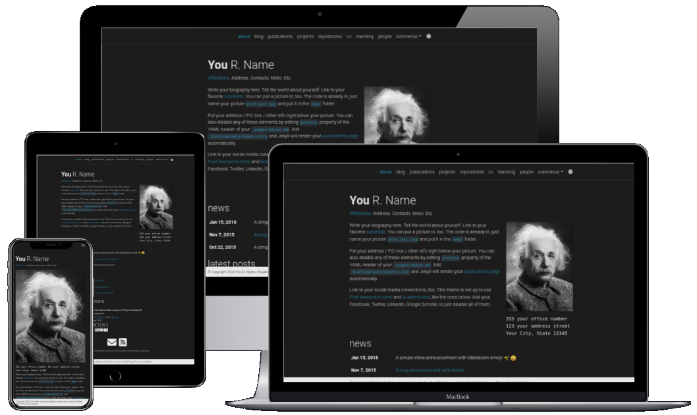
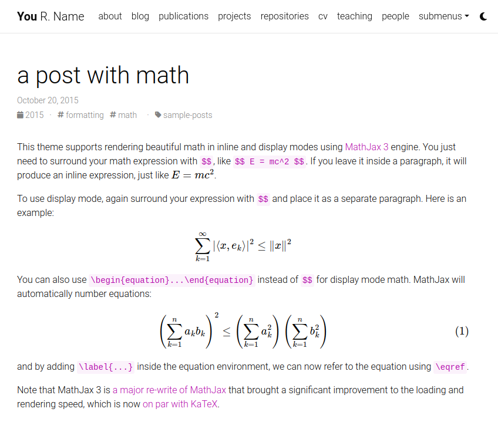
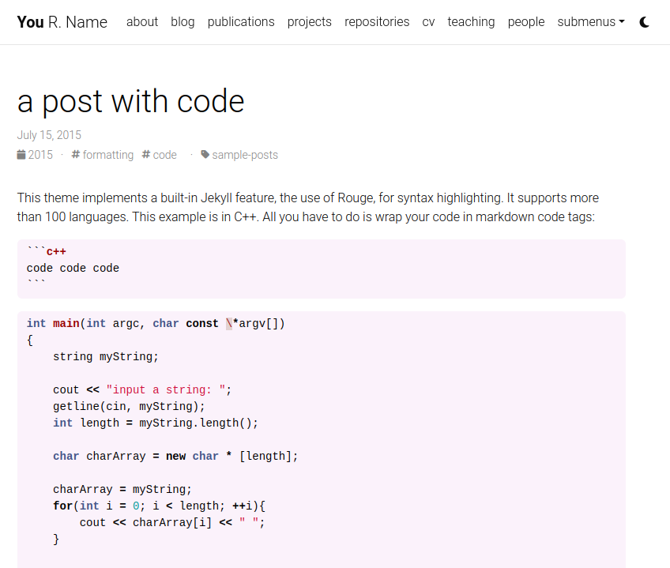

# multi-language-al-folio

<div align="center">

[](https://george-gca.github.io/multi-language-al-folio/)

**Uma versão multilíngue do [tema al-folio](https://github.com/alshedivat/al-folio), um tema [Jekyll](https://jekyllrb.com/) simples, limpo e responsivo para acadêmicos.**

---

[](https://github.com/george-gca/multi-language-al-folio/actions/workflows/deploy.yml)
[](https://app.netlify.com/sites/multi-language-al-folio/deploys)
[](#mantenedores)
[](https://github.com/george-gca/multi-language-al-folio/graphs/contributors/)

[](https://hub.docker.com/r/georgegca/multi-language-al-folio)
[](https://hub.docker.com/r/georgegca/multi-language-al-folio)
[](https://hub.docker.com/r/georgegca/multi-language-al-folio)

[](https://github.com/george-gca/multi-language-al-folio/releases/latest)
[](https://github.com/george-gca/multi-language-al-folio/blob/main/LICENSE)
[](https://github.com/george-gca/multi-language-al-folio)
[](https://github.com/george-gca/multi-language-al-folio/fork)

[](README.md)

</div>

## Comunidade de Usuários

A vibrante comunidade de usuários do **al-folio** está crescendo!
Acadêmicos ao redor do mundo utilizam este tema para suas páginas pessoais, blogs, páginas de laboratórios, assim como para cursos, workshops, conferências, encontros e muito mais.
Confira as páginas da comunidade no [README em inglês](README.md#user-community).
Sinta-se à vontade para adicionar a(s) sua(s) própria(s) página(s) enviando um PR.

## Lighthouse PageSpeed Insights

### Desktop

[](https://htmlpreview.github.io/?https://github.com/george-gca/multi-language-al-folio/blob/main/lighthouse_results/desktop/george_gca_github_io_multi_language_al_folio_.html)

Execute o teste você mesmo: [Google Lighthouse PageSpeed Insights](https://pagespeed.web.dev/report?url=https%3A%2F%2Fgeorge-gca.github.io%2Fmulti-language-al-folio%2F&form_factor=desktop)

### Mobile

[](https://htmlpreview.github.io/?https://github.com/george-gca/multi-language-al-folio/blob/main/lighthouse_results/mobile/george_gca_github_io_multi_language_al_folio_.html)

Execute o teste você mesmo: [Google Lighthouse PageSpeed Insights](https://pagespeed.web.dev/report?url=https%3A%2F%2Fgeorge-gca.github.io%2Fmulti-language-al-folio%2F&form_factor=mobile)

## Índice

- [multi-language-al-folio](#multi-language-al-folio)
  - [Comunidade de Usuários](#comunidade-de-usuários)
  - [Lighthouse PageSpeed Insights](#lighthouse-pagespeed-insights)
    - [Desktop](#desktop)
    - [Mobile](#mobile)
  - [Índice](#índice)
  - [Começando](#começando)
  - [Instalação e Implantação](#instalação-e-implantação)
  - [Personalizando](#personalizando)
  - [Recursos](#recursos)
    - [Suporte Multilíngue](#suporte-multilíngue)
    - [Modo Claro/Escuro](#modo-claroescuro)
    - [Currículo (CV)](#currículo-cv)
    - [Pessoas](#pessoas)
    - [Publicações](#publicações)
    - [Coleções](#coleções)
    - [Layouts](#layouts)
      - [O estilo icônico do Distill](#o-estilo-icônico-do-distill)
      - [Suporte completo para matemática e código](#suporte-completo-para-matemática-e-código)
      - [Fotos, Áudio, Vídeo e mais](#fotos-áudio-vídeo-e-mais)
    - [Outros recursos](#outros-recursos)
      - [Repositórios do GitHub e estatísticas do usuário](#repositórios-do-github-e-estatísticas-do-usuário)

## Começando

Quer aprender mais sobre Jekyll? Confira [este tutorial](https://www.taniarascia.com/make-a-static-website-with-jekyll/).
Por que Jekyll? Leia [o post no blog do Andrej Karpathy](https://karpathy.github.io/2014/07/01/switching-to-jekyll/)!
Por que escrever um blog? Leia [o post da Rachel Thomas](https://medium.com/@racheltho/why-you-yes-you-should-blog-7d2544ac1045).

## Instalação e Implantação

Para detalhes de instalação e implantação, consulte [INSTALL.md](INSTALL.pt-br.md).

## Personalizando

Para detalhes de personalização, consulte [CUSTOMIZE.md](CUSTOMIZE.pt-br.md).

## Recursos

### Suporte Multilíngue

Em uma versão anterior, isso era feito utilizando o [jekyll-multiple-languages-plugin](https://github.com/kurtsson/jekyll-multiple-languages-plugin), mas como o repositório do plugin foi arquivado, ele foi substituído pelo plugin [polyglot](https://github.com/untra/polyglot).
Este plugin foi criado com base nas funcionalidades do [jekyll-multiple-languages-plugin](https://github.com/kurtsson/jekyll-multiple-languages-plugin) e é mantido ativamente. Para mais informações sobre essa mudança, veja [UPGRADING.md](UPGRADING.md).

O idioma padrão (usado como alternativa caso um link para outro idioma não seja encontrado) será o definido como `default_lang` no arquivo [\_config.yml](_config.yml).
Ao utilizar dois idiomas, o tema exibirá um botão no cabeçalho que alterna diretamente para o outro idioma.


Também é possível exibir a bandeira do país em vez do nome do idioma.


Ao utilizar três ou mais idiomas, um menu dropdown será criado com todas as línguas disponíveis.


Note que, ao longo dos arquivos [README.md](README.pt-br.md) e [CUSTOMIZE.md](CUSTOMIZE.pt-br.md), o idioma padrão é o inglês (LANG = en-us).
Você deve ter um arquivo ou caminho equivalente para cada idioma definido no [\_config.yml](_config.yml).
Por exemplo, se você definiu `languages: ["en-us", "pt-br"]`, deverá ter 2 versões do arquivo `_data/LANG/cv.yml`: [\_data/en-us/cv.yml](_data/en-us/cv.yml) e [\_data/pt-br/cv.yml](_data/pt-br/cv.yml).

---

### Modo Claro/Escuro

Este template possui um modo claro/escuro embutido.
Ele detecta a preferência de esquema de cores do usuário e alterna automaticamente.
Você também pode alternar manualmente entre os modos claro e escuro clicando no ícone de sol/lua no canto superior direito da página.

<p align="center">


</p>

---

### Currículo (CV)

Atualmente, existem 2 formas de gerar o conteúdo da página do currículo.
A primeira utiliza um arquivo json localizado em [assets/json/resume_LANG.json](assets/json/resume_en-us.json).
Trata-se de um [padrão conhecido](https://jsonresume.org/) para criar um currículo programaticamente.
A segunda, atualmente utilizada como alternativa quando o arquivo json não for encontrado, usa um arquivo yml localizado em [\_data/LANG/cv.yml](_data/en-us/cv.yml).
Esta foi a forma original de criar o conteúdo da página do currículo e, por ser mais legível, decidimos mantê-la como opção.

Ou seja, se não houver dados de currículo definidos no [\_config.yml](_config.yml) e carregados via um arquivo json, o conteúdo de [\_data/LANG/cv.yml](_data/en-us/cv.yml) será usado como alternativa.

[](https://george-gca.github.io/multi-language-al-folio/cv/)

---

### Pessoas

Você pode criar uma página de pessoas caso deseje apresentar mais de uma pessoa.
Cada pessoa pode ter sua própria bio breve, foto de perfil e definir se todas as pessoas aparecerão em lados opostos ou iguais.

[](https://george-gca.github.io/multi-language-al-folio/people/)

---

### Publicações

A página de publicações é gerada automaticamente a partir da sua bibliografia em BibTex.
Basta editar [\_bibliography/papers.bib](_bibliography/papers.bib).
Você também pode adicionar novos arquivos `*.bib` e personalizar a aparência de suas publicações editando [\_pages/LANG/publications.md](_pages/en-us/publications.md).
Por padrão, as publicações são ordenadas por ano, exibindo as mais recentes primeiro.
Você pode alterar esse comportamento e outros detalhes na seção `Jekyll Scholar` do arquivo [\_config.yml](_config.yml).

Você pode adicionar informações extras a uma publicação, como um arquivo PDF na pasta [assets/pdf/](assets/pdf/) e informar o caminho para o arquivo no registro BibTeX com o campo `pdf`.
Alguns dos campos suportados são: `abstract`, `altmetric`, `arxiv`, `bibtex_show`, `blog`, `code`, `dimensions`, `doi`, `eprint`, `html`, `isbn`, `pdf`, `pmid`, `poster`, `slides`, `supp`, `video` e `website`.

[](https://george-gca.github.io/multi-language-al-folio/publications/)

---

### Coleções

Este tema Jekyll utiliza `collections` para que você possa categorizar seu trabalho.
O tema já vem com duas coleções padrão: `news` e `projects`.
Itens da coleção `news` são automaticamente exibidos na página inicial.
Itens da coleção `projects` são apresentados em uma grade responsiva na página de projetos.

[](https://george-gca.github.io/multi-language-al-folio/projects/)

Você pode facilmente criar suas próprias coleções, como apps, contos, cursos ou qualquer outro trabalho criativo.
Para isso, edite as coleções no arquivo [\_config.yml](_config.yml), crie uma pasta correspondente e uma página de entrada para sua coleção, similar ao arquivo `_pages/projects.md`.

---

### Layouts

O **al-folio** vem com layouts elegantes para páginas e posts de blog.

#### O estilo icônico do Distill

O tema permite que você crie posts de blog no estilo do [distill.pub](https://distill.pub/):

[](https://george-gca.github.io/multi-language-al-folio/blog/2018/distill/)

Para mais detalhes sobre como criar posts no estilo distill utilizando as tags `<d-*>`, consulte [o exemplo](https://george-gca.github.io/multi-language-al-folio/blog/2018/distill/).

#### Suporte completo para matemática e código

O **al-folio** oferece suporte rápido para renderização de fórmulas matemáticas via [MathJax](https://www.mathjax.org/) e para realce de sintaxe de código utilizando o [estilo do GitHub](https://github.com/jwarby/jekyll-pygments-themes).
Também suporta gráficos com [chartjs](https://www.chartjs.org/), diagramas com [mermaid](https://mermaid-js.github.io/mermaid/#/), e figuras em [TikZ](https://tikzjax.com/).

<p align="center">
<a href="https://george-gca.github.io/multi-language-al-folio/blog/2015/math/" target="_blank"></a>
<a href="https://george-gca.github.io/multi-language-al-folio/blog/2015/code/" target="_blank"></a>
</p>

#### Fotos, Áudio, Vídeo e mais

A formatação de fotos é simplificada utilizando o sistema de grid do [Bootstrap](https://getbootstrap.com/docs/4.4/layout/grid/).
Crie facilmente grades bonitas em seus posts e páginas de projetos, com suporte também para adição de [vídeo](https://george-gca.github.io/multi-language-al-folio/blog/2023/videos/) e [áudio](https://george-gca.github.io/multi-language-al-folio/blog/2023/audios/):

<p align="center">
  <a href="https://george-gca.github.io/multi-language-al-folio/projects/1_project/">
    
  </a>
</p>

---

### Outros recursos

#### Repositórios do GitHub e estatísticas do usuário

O **al-folio** utiliza [github-readme-stats](https://github.com/anuraghazra/github-readme-stats) e [github-profile-trophy](https://github.com/ryo-ma/github-profile-trophy) para exibir repositórios e estatísticas do usuário na página `/repositories/`.

[](https://george-gca.github.io/multi-language-al-folio/repositories/)

Edite o arquivo `_data/repositories.yml` e altere as listas `github_users` e `github_repos` para incluir seu perfil e repositórios desejados na página `/repositories/`.

Você também pode usar os códigos abaixo para exibir isso em outras páginas.

```html
<!-- código para usuários do GitHub -->

<div class="repositories d-flex flex-wrap flex-md-row flex-column justify-content-between align-items-center">
    
</div>


<!-- código para troféus do GitHub -->
  
<h4>{{ user }}</h4>

<div class="repositories d-flex flex-wrap flex-md-row flex-column justify-content-between align-items-center">
  
</div>
 

<!-- código para repositórios do GitHub -->

<div class="repositories d-flex flex-wrap flex-md-row flex-column justify-content-between align-items-center">
    
</div>

```
